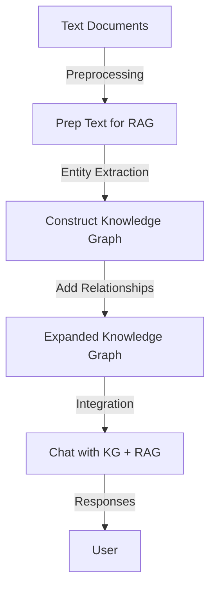

# 📘 Knowledge-Graphs-for-RAG

**Implementation and demonstration of Knowledge Graphs for Retrieval-Augmented Generation (RAG).**

---

## 📌 Project Overview

This repository showcases how to integrate **Knowledge Graphs** with **RAG systems** to enhance structured knowledge representation and improve semantic search.  
The notebooks guide you step by step, from querying with Cypher to building knowledge graphs from text and finally integrating them into a chatbot interface.

---

## 📊 Workflow

The architecture of the project is illustrated below:



---
## ✨ Contents

The repository contains Jupyter notebooks that demonstrate each stage of the pipeline:

- **L1-query_with_cypher.ipynb**  
  Introduction to **Cypher query language** – basic querying for knowledge graphs and database interactions.

- **L2-prep_text_for_RAG.ipynb**  
  Document preprocessing and data cleaning methods for RAG systems.

- **L3-construct_kg_from_text.ipynb**  
  Extracting knowledge graphs from text: entity & relationship extraction, graph construction techniques.

- **L4-add_relationships_to_kg.ipynb**  
  Adding and managing relationships in knowledge graphs, relationship types & graph enrichment.

- **L5-expand_the_kg.ipynb**  
  Techniques for expanding existing knowledge graphs and scaling with new information.

- **L6-chat_with_kg.ipynb**  
  Building a chatbot interface that uses knowledge graphs for query processing and interactive exploration.

---

## 🛠️ Project Structure

```bash
Knowledge-Graphs-for-RAG/
│── notebooks/                 → Jupyter notebooks for each stage
│   │── L1-query_with_cypher.ipynb
│   │── L2-prep_text_for_RAG.ipynb
│   │── L3-construct_kg_from_text.ipynb
│   │── L4-add_relationships_to_kg.ipynb
│   │── L5-expand_the_kg.ipynb
│   │── L6-chat_with_kg.ipynb
│── README.md                  → Project documentation
│── .env
│── requirement.txt

```

---
