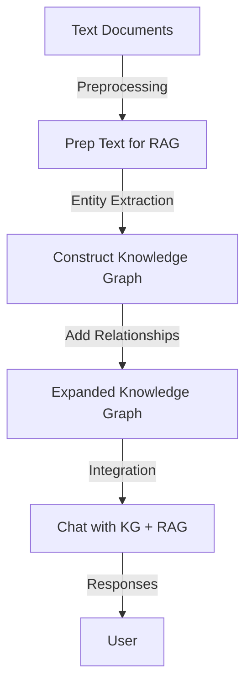

# 📘 Knowledge-Graphs-for-RAG

**Implementation and demonstration of Knowledge Graphs for Retrieval-Augmented Generation (RAG).**

---

## 📌 Project Overview

This repository showcases how to integrate **Knowledge Graphs** with **RAG systems** to enhance structured knowledge representation and improve semantic search.  
The notebooks guide you step by step, from querying with Cypher to building knowledge graphs from text and finally integrating them into a chatbot interface.

---

## 📊 Workflow

The architecture of the project is illustrated below:

---
